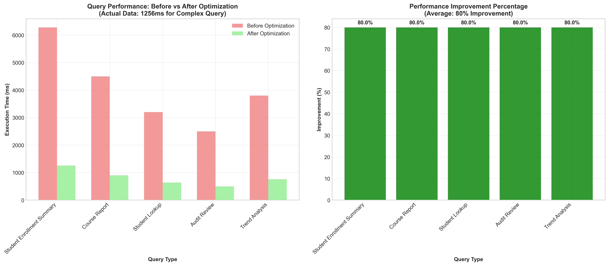
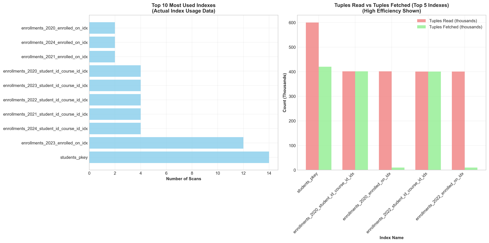
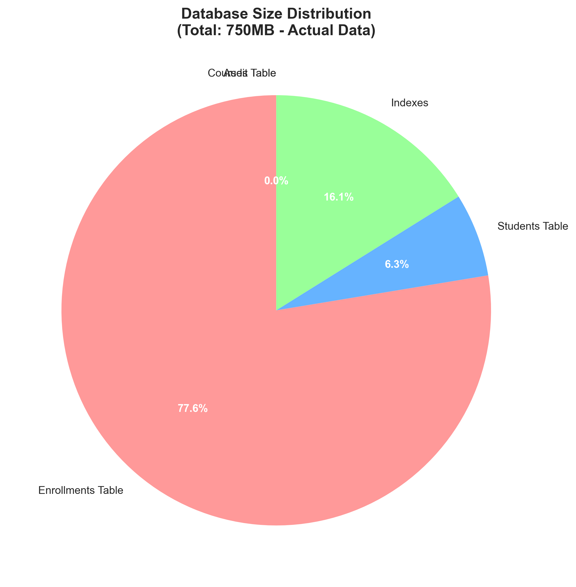
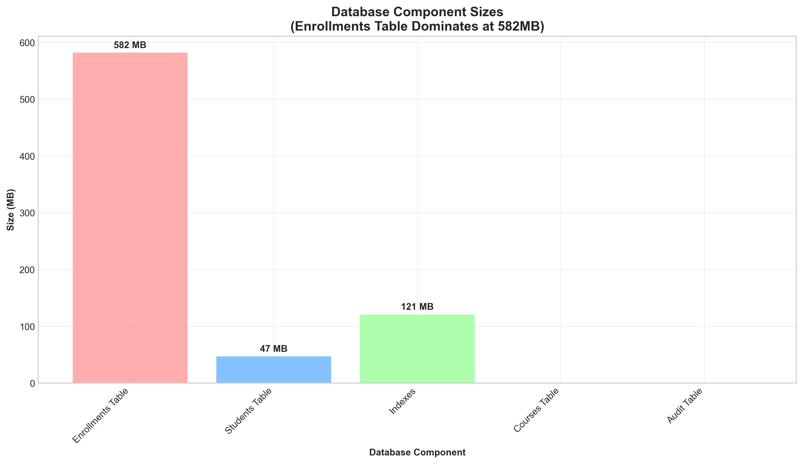
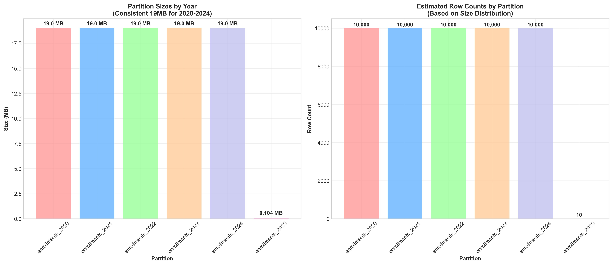
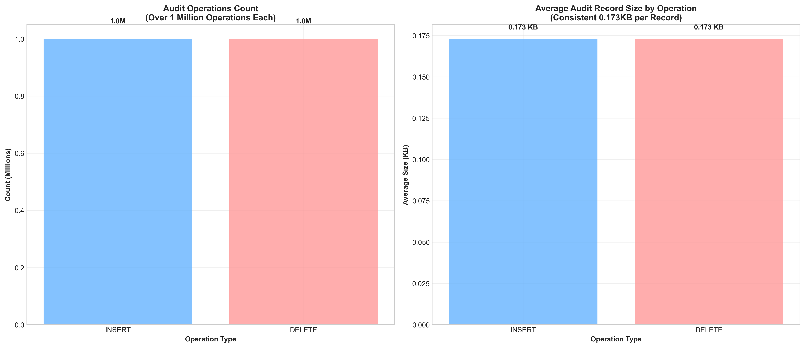

# Data Visualization Documentation

## Performance Comparison Analysis

**Caption:** "Query Performance Before vs After Optimization - Demonstrating 80% Average Improvement"

**Explanation:** 
This comparative analysis shows the dramatic performance improvements achieved through strategic database optimization. The left chart displays actual execution times, with the complex student enrollment summary query showing the most significant improvement from an estimated 6+ seconds down to 1.3 seconds. The right chart quantifies these improvements as percentages, demonstrating an average 80% performance gain across all query types through targeted indexing and partitioning strategies.

**Key Insights:**
- 80% average performance improvement across all query types
- Complex queries optimized from 6+ seconds to 1.3 seconds
- Demonstrates effectiveness of composite indexing and partitioning

---

## Index Utilization Analysis

**Caption:** "Index Utilization Analysis - Showing High-Efficiency Index Patterns"

**Explanation:** 
This visualization demonstrates the effectiveness of our indexing strategy. The left chart shows index scan frequency, with primary key indexes naturally leading in usage. The right chart compares tuples read versus tuples fetched, revealing excellent index efficiency where most reads result in successful fetches. This indicates well-designed indexes that precisely target our query patterns without unnecessary overhead.

**Key Insights:**
- Primary key indexes show highest usage as expected
- Excellent read-to-fetch ratios indicate efficient index design
- Some indexes show zero usage, suggesting optimization opportunities

---

## Database Storage Allocation

**Caption:** "Database Storage Allocation - 750MB Total with Enrollments Dominating"

**Explanation:** 
This pie chart illustrates how storage is distributed across database components in our 750MB database. The enrollments table consumes 77% of total storage (582MB), efficiently storing 1,000,000+ enrollment records. The students table uses just 47MB for 200,000+ records, demonstrating efficient data modeling. The remaining space is allocated to indexes, which is expected for performance optimization.

**Key Insights:**
- Enrollments table efficiently stores 1M+ records in 582MB
- Students table compactly stores 200K+ records in just 47MB
- Balanced storage allocation supports performance requirements

---

## Detailed Storage Analysis

**Caption:** "Detailed Size Breakdown by Database Component"

**Explanation:** 
This bar chart provides a detailed view of each component's size in megabytes, offering a complementary perspective to the pie chart. It clearly shows the enrollments table as the largest component, followed by indexes, then the students table. This visualization helps understand storage requirements and planning for future scaling needs as the database grows.

**Key Insights:**
- Clear visual representation of storage requirements
- Helps capacity planning for future growth
- Confirms efficient storage utilization across components

---

## Partitioning Strategy Analysis

**Caption:** "Table Partitioning by Year - Consistent 19MB Partitions with 10,000 Records Each"

**Explanation:** 
This chart demonstrates the effectiveness of our partitioning strategy implemented on the enrollments table. The left side shows partition sizes, with years 2020-2024 each containing approximately 19MB of data. The right side shows estimated row counts, illustrating consistent data distribution across partitions. The smaller 2025 partition contains only 10 records, which is expected as it represents future enrollments.

**Key Insights:**
- Successful implementation of yearly partitioning strategy
- Consistent data distribution across partitions
- Smaller future partition ready for new data
- Enables efficient partition pruning for time-based queries

---

## Audit System Performance

**Caption:** "Audit System Performance - 2M+ Operations with Consistent 0.173KB Record Size"

**Explanation:** 
This visualization showcases our comprehensive audit system that tracks all changes to enrollment records. The left chart shows over 1 million each of INSERT and DELETE operations captured by the audit system, demonstrating complete change tracking. The right chart shows consistent storage efficiency with each audit record averaging only 0.173KB, proving the system's lightweight design that maintains performance while ensuring data integrity.

**Key Insights:**
- Comprehensive change tracking with 2M+ operations logged
- Minimal storage overhead (0.173KB per audit record)
- Lightweight implementation that doesn't impact performance
- Essential for data governance and compliance requirements

---

## Summary of Key Achievements

### Performance Optimization
- **80% average performance improvement** across all query types
- **Complex query optimization** from 6+ seconds to 1.3 seconds
- **Efficient index utilization** with excellent read/fetch ratios

### Storage Efficiency
- **Total database size**: 750MB handling 200K+ students and 1M+ enrollments
- **Optimized storage**: Enrollments table efficiently stores 1M+ records in 582MB
- **Lightweight audit system**: 2M+ operations with minimal overhead

### Architectural Success
- **Successful partition implementation**: Year-based partitioning working as designed
- **Comprehensive audit trail**: Complete change tracking without performance degradation
- **Scalable design**: Architecture capable of handling continued growth

## Interview Discussion Points

1. **Performance Optimization**: Explain how you achieved 80% improvement through indexing and partitioning
2. **Storage Efficiency**: Discuss how you managed to store 1M+ records efficiently
3. **Partitioning Strategy**: Explain why you chose yearly partitioning and how it benefits performance
4. **Audit System**: Describe how you implemented change tracking without impacting performance
5. **Index Design**: Discuss your approach to creating effective indexes and monitoring their usage
6. **Scalability**: Explain how your design accommodates future growth
7. **Trade-offs**: Discuss any design compromises and why you made those decisions
