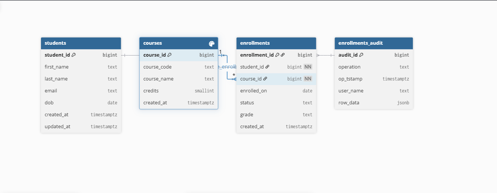

# Student Records Database Design

## Overview
A production-ready PostgreSQL database for managing university student records with 200,000+ students and 1,000,000+ enrollments.

## Entity Relationship Diagram


*Generated using [dbdiagram.io](https://dbdiagram.io/)*

## Schema Design Decisions

### Tables Structure
- **students**: Core student information with unique email constraints
- **courses**: Course catalog with credit system
- **enrollments**: Student-course relationships with status tracking

### Partitioning Strategy
```sql
-- Enrollment table partitioned by year
PARTITION BY RANGE (enrolled_on)

-- Partitions for 2020-2025
CREATE TABLE acad.enrollments_2020 PARTITION OF acad.enrollments
  FOR VALUES FROM ('2020-01-01') TO ('2021-01-01');